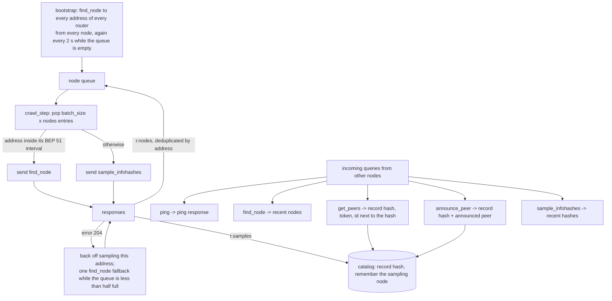
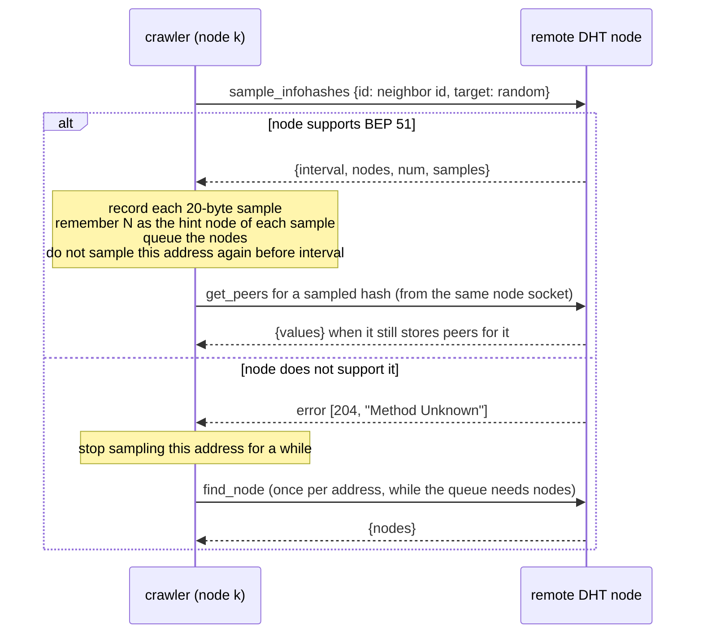
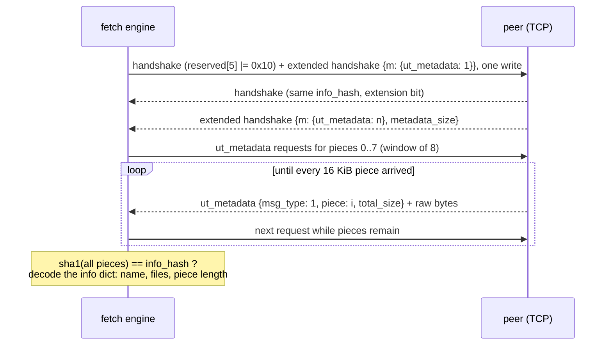
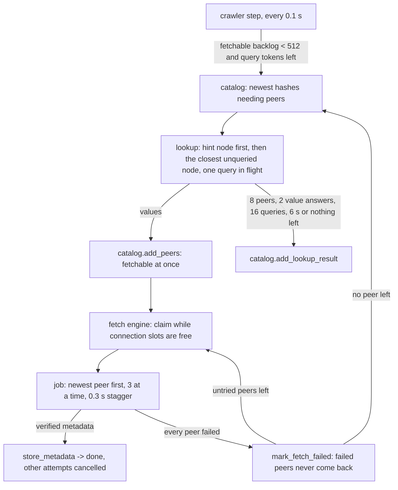

# DHT scraper (educational)

A BitTorrent DHT scraper written in plain Python 3.9 with **no external libraries**. It runs
several simulated DHT nodes in one process, collects info hashes from the mainline DHT, asks
nodes for hash samples (BEP 51), downloads torrent **metadata only** from peers (BEP 9 and
BEP 10, over TCP, with message stream encryption or uTP when a peer needs it) and shows
everything in a small web page. The IPv6 DHT (BEP 32) is available with `--ipv6`.

Nothing is written to disk. The catalog lives in memory and disappears when the process ends.

> **Ethics and scope.** This tool observes public DHT traffic and downloads only the torrent
> *info dictionary* (name, size, file list). It never sends `interested` or `request` messages,
> so it never transfers file content. It is meant for learning how the protocols work. Run it
> briefly, on your own connection, and respect local law. The web page binds to `127.0.0.1`.


## What it does

- Runs `--nodes` DHT nodes (default 8) on consecutive UDP ports, served by one thread and one selector.
- Crawls with `sample_infohashes` (BEP 51) and falls back to `find_node` when a node does not
  support it and the crawl queue needs nodes.
- Answers `ping`, `find_node`, `get_peers`, `announce_peer` and `sample_infohashes` so other
  nodes keep it in their routing tables and send it hashes. `get_peers` replies carry an id next
  to the info hash, so clients that look a torrent up announce themselves to us.
- Keeps every hash in a bounded in-memory catalog (250 000 entries) with counters, peers and a
  fetch state.
- Looks up peers with `get_peers`, asking first the node that sampled the hash, one query in
  flight per lookup, and streams peers to the catalog as they arrive.
- Downloads metadata with one asyncio loop and up to `--fetch-workers` simultaneous connections
  (default 256), three peers of a hash at a time, most-seen hashes first.
- Retries with message stream encryption (RC4) a peer that closes on the plaintext handshake,
  and tries uTP (BEP 29) on a peer that refuses TCP.
- Serves a web page with live stats, search and a detail view, and opens it in your browser.

What it deliberately does not do: persist anything, download content, store DHT items (BEP 44),
authenticate the web page.

## Requirements

- Python 3.9 or later. No packages to install.
- Inbound UDP on the node ports helps (other nodes must be able to reach you), but BEP 51
  sampling, the lookups and the fetches work behind NAT too.
- On Unix the scraper raises its own open file limit to fit the connections (a macOS terminal
  starts at 256).

## Quick start

```bash
python3 -m dht_scraper
```

The browser opens `http://127.0.0.1:8080/`. Watch the stats bar, type in the search box, click a
row for the file list. Stop with Ctrl-C.

Run for a fixed time without the browser and without metadata fetching:

```bash
python3 -m dht_scraper --duration 60 --no-browser --no-fetch
```

Also crawl the IPv6 DHT (more hashes, about 20 % more UDP traffic):

```bash
python3 -m dht_scraper --ipv6
```

## Command line

| Option | Default | Meaning |
|---|---|---|
| `--port` | 6881 | First UDP port. Node *i* uses `port + i`. `0` lets the OS choose |
| `--nodes` | 8 | Number of simulated DHT nodes (1 to 64) |
| `--web-host` | 127.0.0.1 | Web page bind address |
| `--web-port` | 8080 | Web page port (`0` = OS chosen) |
| `--duration` | none | Seconds to run. Without it, run until Ctrl-C |
| `--fetch-workers` | 256 | Simultaneous metadata connections (1 to 1024) |
| `--batch-size` | 6 | Crawl queries per node per interval |
| `--interval` | 0.1 | Seconds between crawl batches |
| `--ipv6` | off | Also run the nodes on the IPv6 DHT (BEP 32), with the same ids |
| `--log-file` | none | Also write the log to this file |
| `--verbose` | off | DEBUG logging: every hash, every web request |
| `--no-fetch` | off | Crawl only |
| `--no-browser` | off | Do not open the browser |

Default traffic, about 1 000 UDP packets per second out: 8 nodes x 6 queries / 0.1 s = 480 crawl
queries, at most 420 lookup queries, the replies to other nodes and a few uTP packets; plus at
most 256 TCP connections. No address receives more than 40 packets in 10 s, below libtorrent's
ban threshold. Lower `--batch-size` or `--fetch-workers` on a slow link.

## How the DHT crawl works



KRPC messages are bencoded dictionaries in UDP datagrams (BEP 5):

| Message | Direction | Fields |
|---|---|---|
| `find_node` | out | `id`, `target` -> `nodes` (26 bytes each), `nodes6` (38 bytes each) on IPv6 |
| `sample_infohashes` | out | `id`, `target` -> `interval`, `nodes`, `num`, `samples` (20 bytes each) |
| `get_peers` | out (lookups) and in | `id`, `info_hash` -> `token`, `values` (6 or 18 bytes each) or `nodes` |
| `announce_peer` | in | `id`, `info_hash`, `port`, `token`, `implied_port` |
| `ping` | in | `id` |
| error | in | `[204, "Method Unknown"]` when a node does not support BEP 51 |

### The neighbor id trick

Every query the scraper sends uses a node id built from the remote node's id:

```
remote id:   R0 R1 R2 R3 R4 R5 R6 R7 R8 R9 R10 R11 R12 R13 R14 | R15 R16 R17 R18 R19
our id:      -------------- copied from the remote id ---------- | -- own 5 bytes ---
```

To the remote node we look like one of its closest neighbors, so it keeps us in its routing
table and sends us `get_peers` and `announce_peer` queries. Each simulated node has its own 5
byte suffix, so N nodes look like N different neighbors. The crawler never queues a node whose
suffix matches one of its own, which prevents it from crawling itself. A reply to `get_peers` or
`announce_peer` copies the first 15 bytes of the *info hash* instead: the client that asked sees
us as the node closest to the torrent and sends us its `announce_peer`, which is a fresh peer.

## BEP 51 sampling



Sampling is active: the first responses already carry up to about 20 hashes each. The neighbor
id trick is passive: it needs minutes before other nodes start announcing to us. Both run at the
same time. A sampled hash comes from the sampling node's own peer storage, so the lookup asks
that node first; libtorrent keeps its sample for up to 6 hours while peers expire after about
45 minutes, so about a third of these first answers carry peers and the others lead to closer nodes.

## Metadata download (BEP 10 + BEP 9)



Wire format of one peer wire frame: `uint32 length`, `uint8 message id`, body. Extended
messages have id 20, then one byte for the extension id, then a bencoded dictionary, then raw
bytes for `ut_metadata` data messages.

Timeouts: connect 1 s (measured: 95 % of successful connects take less than 311 ms), handshake 4 s,
each piece 5 s, whole session 15 s. Failure reasons: `connect_timeout`, `connect` (refused),
`closed_on_handshake`, `closed`, `timeout`, `bad_handshake`, `hash_mismatch`, `no_extensions`,
`no_ut_metadata`, `too_large` (over 4 MiB), `reject`, `bad_piece`, `sha1_mismatch`,
`frame_too_large` (over 1 MiB), `encryption_failed`, `bad_info_dict`, `local_error` (our side ran
out of descriptors or ports: nobody is blamed), `skipped_unreachable` (the address timed out or
refused within the last 10 minutes, not tried again).

**Message stream encryption.** A peer that closes before sending one handshake byte may require
encryption. It is retried once, on the same connection slot, with MSE: Diffie-Hellman over the
768-bit prime, `SHA1("req1", S)` and the obfuscated info hash, then RC4 keyed with
`SHA1("keyA" or "keyB", S, info hash)` after dropping 1 024 bytes, with our two handshakes in the
initial payload. The peer may pick RC4 or plaintext for the rest of the session.

**uTP.** A peer that refuses the TCP connection is tried over uTP (BEP 29) when one of 48 uTP
slots is free: one UDP socket multiplexes the connections by connection id; SYN and data are
resent after 1 s (doubling, 4 times); out-of-order packets wait in a buffer; every data packet is
acknowledged with the measured one-way delay.

The client never sends `interested` or `request`, so a peer cannot push content, and any `piece`
frame that arrives anyway is discarded.

## Peer lookups and the fetch engine



Peers come from `announce_peer` senders and from `get_peers` lookups. A lookup keeps one query in
flight (measured: 1.12 peers found per query, against 0.58 with four queries in flight), accepts
a reply only from the address it asked, and pushes peers to the catalog as soon as a `values`
answer arrives. All lookups share a budget of 420 queries per second, at most 256 run at once, and
at most 4 queries are in flight to the same node. The fetch engine claims candidates only while
connection slots are free, so the ranking is always recomputed on fresh counters.

## Logging

Format: `time LEVEL [thread] message`. INFO shows start, bootstrap, a summary every 10 s (packets,
samples, hashes, discovered hashes, metadata, fetch attempts, open connections, crawl queue,
lookups), each stored metadata record, web page actions and shutdown. `--verbose` adds every hash
seen through `get_peers` and `announce_peer`, lookup progress, failed fetches and the stats
polling. `--log-file` duplicates the log to a file.

## Performance

Measured on 2026-09-24 on a home fibre line (IPv4 behind NAT, Apple M4), 60 s runs of
`python3 -m dht_scraper --duration 60 --no-browser` with default settings, before and after runs
alternating with pauses in between. Counters are read at the deadline; unique hashes are counted
outside the catalog, so its capacity does not cap them.

| Metric, 60 s | Before: 6 runs, median [range] | After: 3 runs, median [range] |
|---|---|---|
| Unique info hashes found | 151 711 [67 501 - 188 067] | 218 770 [217 640 - 233 171] |
| Metadata downloaded and SHA-1 verified | 15 [7 - 20] | 825 [797 - 846] |
| Peer connection attempts | 371 [140 - 475] | 13 080 [12 766 - 13 687] |
| Attempts that end with metadata | 4.2 % [3.0 - 6.2] | 6.3 % [5.8 - 6.6] |
| `get_peers` lookups started | 413 [159 - 507] | 3 980 [3 965 - 4 044] |
| `sample_infohashes` queries sent | 19 518 [9 648 - 23 324] | 27 864 [27 829 - 27 973] |
| UDP packets sent per second | 451 [220 - 544] | 1 013 [1 011 - 1 041] |
| Peer connections at once | 32 threads | 256 |
| CPU (share of one core) | 18 % | 44 % |
| Peak memory | 105 MB | 201 MB |

The old bootstrap cached one address per router and three of its four routers no longer answer:
in three of the six "before" runs it lost 10 to 20 s before the first sample, hence its wide
range. Where the metadata gain comes from, in measured steps: many simultaneous connections with a
1 s connect timeout (the old 32 threads spent 77 % of their time waiting for dead peers), lookups
that ask the sampling node first and keep one query in flight, peers streamed to the catalog,
immediate retries on untried peers, and a cache of unreachable addresses. `--ipv6` adds about 30 %
more hashes for about 20 % more traffic.

## Limitations

- Inbound UDP is needed for the passive path (other nodes announcing to us).
- Everything is lost on exit, and the catalog is capped at 250 000 hashes.
- `seen_count` is a rough popularity signal, not a swarm size.
- Most peers cannot be reached: about 60 % of TCP connects time out (NAT, firewall, offline) and
  15 % are refused. About 6 % of connection attempts end with verified metadata.
- Only nodes that implement BEP 51 answer sampling; the rest are crawled with `find_node`.
- IPv6 is off by default: within the same traffic budget it found as many hashes and fewer
  metadata than IPv4 alone. With `--ipv6` the hashes grow by about 30 % for about 20 % more traffic.
- uTP is only used after a TCP refusal and with a small budget; MSE only after a close on the
  plaintext handshake. Each adds about 1 to 3 % of downloads.

## Tests

| Category | Command |
|---|---|
| codec | `python3 -m unittest discover -s tests/codec -t .` |
| protocol | `python3 -m unittest discover -s tests/protocol -t .` |
| catalog | `python3 -m unittest discover -s tests/catalog -t .` |
| network | `python3 -m unittest discover -s tests/network -t .` |
| fetch | `python3 -m unittest discover -s tests/fetch -t .` |
| web | `python3 -m unittest discover -s tests/web -t .` |
| runtime | `python3 -m unittest discover -s tests/runtime -t .` |
| cli | `python3 -m unittest discover -s tests/cli -t .` |

All tests run offline with fake sockets, loopback sockets on port 0 (IPv4 and `::1`), and fake
peers for TCP, MSE and uTP. Test methods carry the ID of the spec they check, for example
`test_LOOKUP_001_...`.

## Code layout

| Module | Role |
|---|---|
| `bencode_codec.py` | bencode encode and decode |
| `node_identity.py` | node ids, neighbor ids, XOR distance, transaction and peer ids |
| `krpc_messages.py` | KRPC builders and decoders, compact nodes and peers (IPv4 and IPv6), address filter |
| `dht_node_sockets.py` | N UDP sockets per family, one id each |
| `dht_crawler.py` | crawler thread: selector loop, BEP 51 crawl, query answering, per-address cap |
| `dht_lookup.py` | continuous `get_peers` lookups with hint nodes and a query budget |
| `peer_wire_messages.py` | handshake, frames, extension protocol, `ut_metadata` |
| `metadata_fetcher.py` | one metadata session with a peer over any byte stream, TCP connect |
| `stream_encryption.py` | message stream encryption: Diffie-Hellman, RC4, negotiation |
| `utp_transport.py` | uTP client on one UDP socket |
| `fetch_engine.py` | the fetch thread: asyncio loop, connection slots, jobs, reachability cache |
| `torrent_info_summary.py` | info dict to a small metadata record |
| `torrent_catalog.py` | bounded in-memory catalog, ranking, fetch and lookup state, search |
| `bounded_recent_map.py` | insertion-ordered mapping with a size cap |
| `magnet_link.py`, `web_page.py`, `web_interface.py` | magnet links, the page, the HTTP API |
| `scraper_runtime.py` | thread wiring, stats, browser launch, shutdown |
| `__main__.py` | command line |

The specification lives in `spec/`, indexed by `spec/README.md`.

## License

CC0 1.0 Universal (public domain dedication). See [LICENSE](LICENSE).
