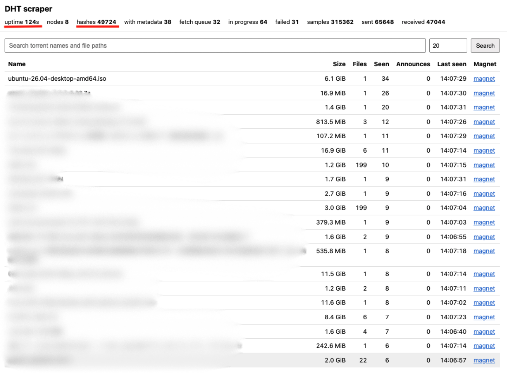
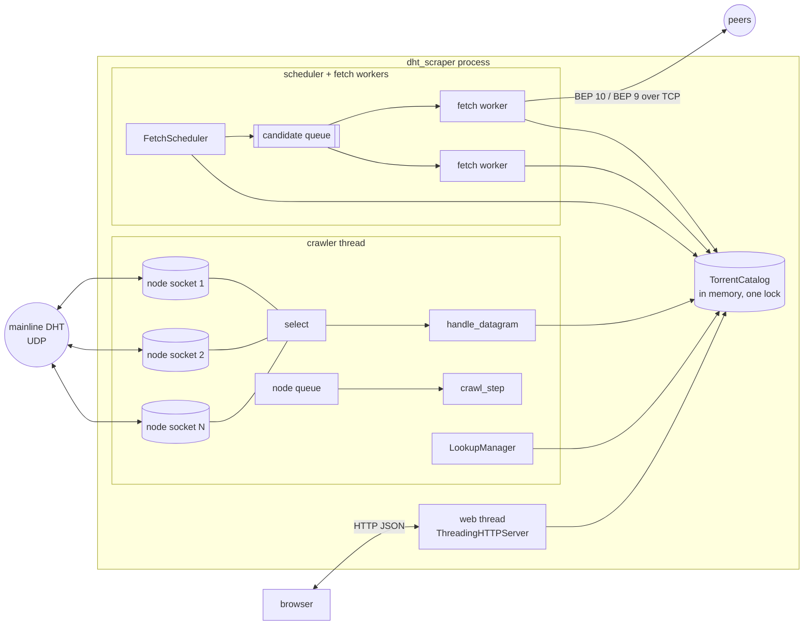
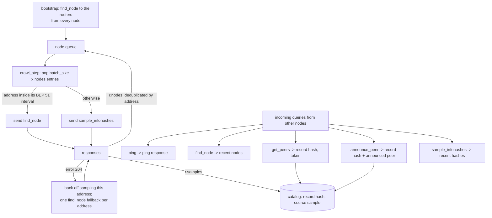
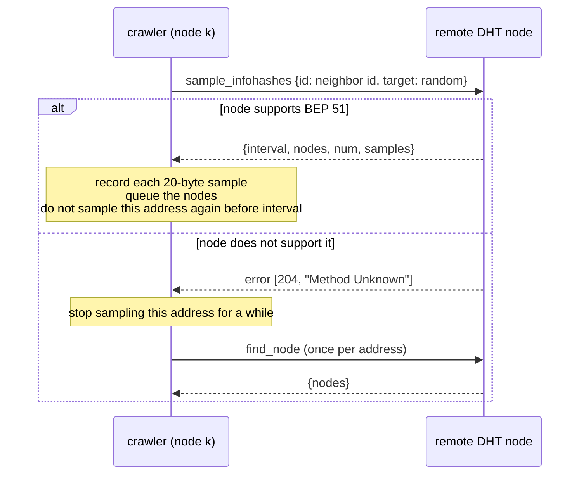
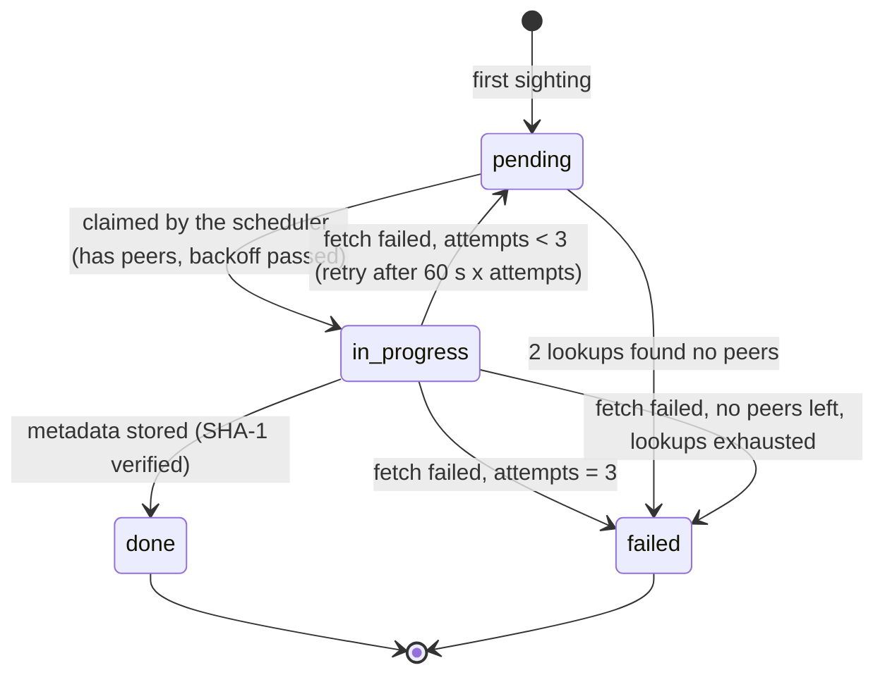
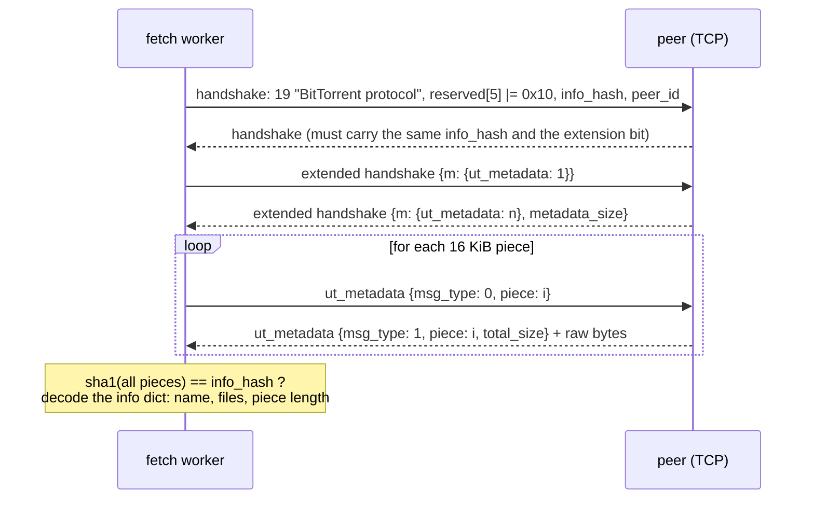
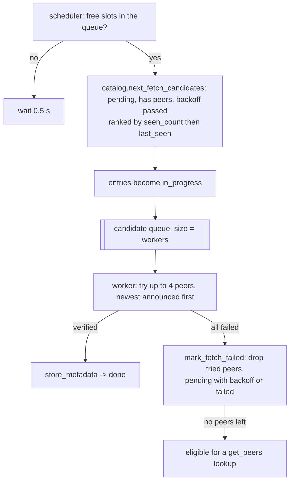
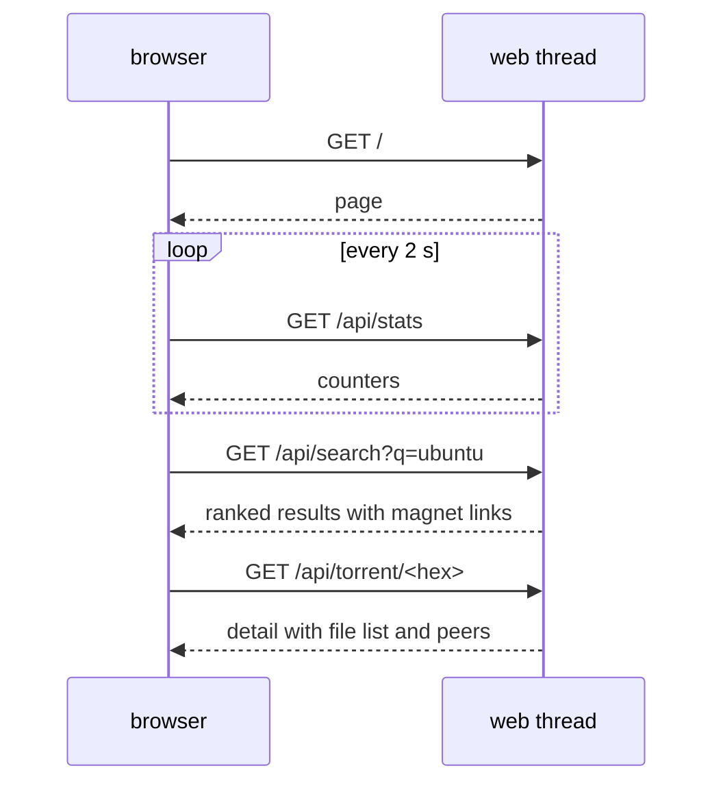

# DHT scraper (educational)

A BitTorrent DHT scraper written in plain Python 3.9 with **no external libraries**. It runs
several simulated DHT nodes in one process, collects info hashes from the mainline DHT, asks
nodes for hash samples (BEP 51), downloads torrent **metadata only** from peers (BEP 9 and
BEP 10) and shows everything in a small web page.

Nothing is written to disk. The catalog lives in memory and disappears when the process ends.

> **Ethics and scope.** This tool observes public DHT traffic and downloads only the torrent
> *info dictionary* (name, size, file list). It never sends `interested` or `request` messages,
> so it never transfers file content. It is meant for learning how the protocols work. Run it
> briefly, on your own connection, and respect local law. The web page binds to `127.0.0.1`.



## What it does

- Runs `--nodes` DHT nodes (default 8) on consecutive UDP ports with one thread and one `select()`.
- Crawls with `sample_infohashes` (BEP 51), falls back to `find_node` when a node does not support it.
- Answers `ping`, `find_node`, `get_peers`, `announce_peer` and `sample_infohashes` so other
  nodes keep it in their routing tables and send it hashes.
- Keeps every hash in a bounded in-memory catalog with counters, peers and a fetch state.
- Fetches metadata over TCP, most-seen hashes first, with `--fetch-workers` threads (default 32).
- Finds peers from `announce_peer` senders and from small iterative `get_peers` lookups.
- Serves a web page with live stats, search and a detail view, and opens it in your browser.

What it deliberately does not do: persist anything, download content, speak IPv6 or uTP,
encrypt the peer wire, authenticate the web page.

## Requirements

- Python 3.9 or later. No packages to install.
- Inbound UDP on the node ports helps a lot (other nodes must be able to reach you), but BEP 51
  sampling and the lookups work behind NAT too.

## Quick start

```bash
python3 -m dht_scraper
```

The browser opens `http://127.0.0.1:8080/`. Watch the stats bar, type in the search box, click a
row for the file list. Stop with Ctrl-C.

Run for a fixed time without the browser and without metadata fetching:

```bash
python3 -m dht_scraper --duration 60 --no-browser --no-fetch
```

## Command line

| Option | Default | Meaning |
|---|---|---|
| `--port` | 6881 | First UDP port. Node *i* uses `port + i`. `0` lets the OS choose |
| `--nodes` | 8 | Number of simulated DHT nodes (1 to 64) |
| `--web-host` | 127.0.0.1 | Web page bind address |
| `--web-port` | 8080 | Web page port (`0` = OS chosen) |
| `--duration` | none | Seconds to run. Without it, run until Ctrl-C |
| `--fetch-workers` | 32 | Metadata fetch threads (1 to 256) |
| `--batch-size` | 5 | Crawl queries per node per interval |
| `--interval` | 0.1 | Seconds between crawl batches |
| `--log-file` | none | Also write the log to this file |
| `--verbose` | off | DEBUG logging: every hash, every web request |
| `--no-fetch` | off | Crawl only |
| `--no-browser` | off | Do not open the browser |

Default traffic: 8 nodes x 5 queries / 0.1 s = 400 small UDP packets per second (about 40 KB/s
out) plus the replies. Lower `--nodes` or raise `--interval` on a slow link.

## Architecture



| Thread | Count | Job |
|---|---|---|
| main | 1 | starts everything, waits, handles Ctrl-C, stops everything |
| crawler | 1 | one `select()` over all node sockets, crawl queue, lookups |
| scheduler | 0 or 1 | re-ranks candidates and fills the bounded queue |
| fetch-N | `--fetch-workers` | blocking TCP sessions with peers |
| web | 1 | serves the page and the JSON API |

Shutdown order: set the stop event, stop the web server, join the scheduler (it drains the
queue and releases claims), join the workers (in-flight fetches abort within about a second, a
pending TCP connect within its 5 s timeout), join the crawler, close the sockets, print a final
summary. If the crawler is still blocked in a slow DNS lookup after its 5 s join timeout, its
sockets are left open rather than closed under it, and a warning is logged.

## How the DHT crawl works



KRPC messages are bencoded dictionaries in UDP datagrams (BEP 5):

| Message | Direction | Fields |
|---|---|---|
| `find_node` | out | `id`, `target` -> `nodes` (26 bytes each) |
| `sample_infohashes` | out | `id`, `target` -> `interval`, `nodes`, `num`, `samples` (20 bytes each) |
| `get_peers` | out (lookups) and in | `id`, `info_hash` -> `token`, `values` or `nodes` |
| `announce_peer` | in | `id`, `info_hash`, `port`, `token`, `implied_port` |
| `ping` | in | `id` |
| error | in | `[204, "Method Unknown"]` when a node does not support BEP 51 |

### The neighbor id trick

Every query the scraper sends uses a node id built from the remote node's id:

```
remote id:   R0 R1 R2 R3 R4 R5 R6 R7 R8 R9 R10 R11 R12 R13 R14 | R15 R16 R17 R18 R19
our id:      -------------- copied from the remote id ---------- | -- own 5 bytes ---
```

To the remote node we look like one of its closest neighbors, so it keeps us in its routing
table and sends us `get_peers` and `announce_peer` queries. Each simulated node has its own 5
byte suffix, so N nodes look like N different neighbors. The crawler never queues a node whose
suffix matches one of its own, which prevents it from crawling itself.

## BEP 51 sampling



Sampling is active: the first responses already carry up to about 20 hashes each. The neighbor
id trick is passive: it needs minutes before other nodes start announcing to us. Both run at the
same time.

## The in-memory catalog

Per hash: `seen_count`, `announce_count`, `first_seen`, `last_seen`, up to 32 candidate peers,
fetch state, attempts, retry time, lookup state, and the metadata once fetched.



Capacity is 50 000 entries. When full, the 5 % least valuable entries are evicted: entries
without metadata first, then the lowest seen count, then the oldest. Entries that are in
progress are never evicted. Ranking is recomputed from live counters on every scheduling round,
so there is no priority heap that can go stale.

## Metadata download (BEP 10 + BEP 9)



Wire format of one peer wire frame: `uint32 length`, `uint8 message id`, body. Extended
messages have id 20, then one byte for the extension id, then a bencoded dictionary, then raw
bytes for `ut_metadata` data messages.

Failure reasons (each one ends the session and moves on to the next peer): `connect`, `closed`,
`timeout`, `bad_handshake`, `hash_mismatch`, `no_extensions`, `no_ut_metadata`, `too_large`
(over 4 MiB), `reject`, `bad_piece`, `sha1_mismatch`, `frame_too_large` (over 1 MiB).

The worker never sends `interested` or `request`, so a peer cannot push content, and any `piece`
frame that arrives anyway is discarded.

## Fetch scheduling



Peers come from two sources. `announce_peer` senders are recorded with their announced port.
Hashes without peers get an iterative `get_peers` lookup: up to 4 rounds of 8 queries to the
closest known nodes, finished as soon as one node returns `values`, with a deadline of 8 s. A
reply is only accepted from the address that was actually queried. At most 16 lookups run at a
time, all inside the crawler thread without blocking it. A hash whose lookups are exhausted and
whose peers all failed to answer moves to `failed` rather than sitting in `pending` forever.

## Web page

| Route | Returns |
|---|---|
| `/` | the page (inline CSS and JavaScript, no external assets) |
| `/api/stats` | one flat JSON object with all counters |
| `/api/search?q=&limit=` | `{query, limit, count, results: [...]}` ranked by seen count |
| `/api/torrent/<40 hex>` | counters, fetch state, peers, metadata with the full file list |



Example search result:

```json
{"info_hash": "0a0a...", "name": "ubuntu-24.04.iso", "size": 6114656256, "file_count": 1,
 "seen_count": 17, "announce_count": 4, "first_seen": 1725000000.0, "last_seen": 1725000300.0,
 "magnet": "magnet:?xt=urn:btih:0a0a...&dn=ubuntu-24.04.iso"}
```

All data reaches the page as JSON and is rendered with `textContent`, so torrent names can
never inject HTML. The page is served with a strict Content-Security-Policy.

## Logging

Format: `time LEVEL [thread] message`. INFO shows start, bootstrap, a summary every 10 s, each
stored metadata record, web page actions and shutdown. `--verbose` adds every hash seen through
`get_peers` and `announce_peer`, lookup progress and the stats polling. `--log-file` duplicates
the log to a file.

## Limitations

- Inbound UDP is needed for the passive path (other nodes announcing to us).
- IPv4 only.
- Everything is lost on exit, and the catalog is capped at 50 000 hashes.
- `seen_count` is a rough popularity signal, not a swarm size.
- Many peers refuse metadata (no extension support, choked, wrong torrent). Expect a low
  success ratio per peer; the scheduler compensates by trying popular hashes first.
- Only nodes that implement BEP 51 answer sampling; the rest are crawled with `find_node`.

## Tests

| Category | Command |
|---|---|
| codec | `python3 -m unittest discover -s tests/codec -t .` |
| protocol | `python3 -m unittest discover -s tests/protocol -t .` |
| catalog | `python3 -m unittest discover -s tests/catalog -t .` |
| network | `python3 -m unittest discover -s tests/network -t .` |
| fetch | `python3 -m unittest discover -s tests/fetch -t .` |
| web | `python3 -m unittest discover -s tests/web -t .` |
| runtime | `python3 -m unittest discover -s tests/runtime -t .` |
| cli | `python3 -m unittest discover -s tests/cli -t .` |

All tests run offline with fake sockets, loopback sockets on port 0 and a fake `ut_metadata`
peer.

## Code layout

| Module | Role |
|---|---|
| `bencode_codec.py` | bencode encode and decode |
| `node_identity.py` | node ids, neighbor ids, XOR distance, transaction and peer ids |
| `krpc_messages.py` | KRPC builders and decoders, compact nodes and peers |
| `dht_node_sockets.py` | N UDP sockets, one id each |
| `dht_crawler.py` | crawler thread: select loop, BEP 51 crawl, query answering |
| `dht_lookup.py` | iterative `get_peers` lookups |
| `peer_wire_messages.py` | handshake, frames, extension protocol, `ut_metadata` |
| `metadata_fetcher.py` | one TCP session with a peer |
| `torrent_info_summary.py` | info dict to a small metadata record |
| `torrent_catalog.py` | bounded in-memory catalog, ranking, fetch and lookup state, search |
| `fetch_scheduler.py`, `fetch_worker_pool.py` | scheduling and worker threads |
| `bounded_recent_map.py` | insertion-ordered mapping with a size cap |
| `magnet_link.py`, `web_page.py`, `web_interface.py` | magnet links, the page, the HTTP API |
| `scraper_runtime.py` | thread wiring, stats, browser launch, shutdown |
| `__main__.py` | command line |

The specification lives in `spec/`.

## License

MIT. See [LICENSE](LICENSE).
